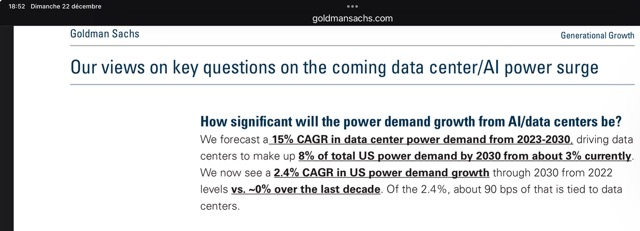

# AI AI AILLE ! Pourquoi j’évite d’utiliser l’IA?

Status: Structure préparée
Espace: LINKEDIN
Cible: Offre 1 : Coach technique, Offre 2 : Dev Régie
Problématique centrale: L’IA est un marteau piqueur pour enfoncer un clou. Energivore. Souvent usages futiles.
Résolution de la pb: Droit dans mes bottes annoncer mon usage restreint de ces technologies
Objectif: Me positionner techniquement et politiquement
TYPE de CONTENU: Opinion

## Les différents types d'algorithmes

| Problème                   | Complexité (big O notation ) | Algo recommandé | LLM |
|----------------------------|------------------------------|-----------------|-----|
| Addition                   | O(1)                         |                 |     |
| Tri                        | O(n log n)                   |                 |     |
| Multiplication matricielle | O( n^3)                      |                 |     |

## Les usages : du futile au critique

## L‘impact

Quelques pistes d’actions à déployer dans votre entreprise, proposées par le Think Tank Impact AI :

- RGESN
- ACV
- Sensibilisation impact carbone de l'IT et en particulier l’IA : lien vers une source de référence (ademe ? inr ?)
- Sobritété dans les choix technologiques
    - usage uniquement lorsque nécessaire
    - priorisation d’un modèle d’IA plus sobre
      - limitation des données inutiles
- Deep Learning : éviter ou limiter, prioriser des modèles moins gourmands
- Limiter les entraînements des algorithmes et des réseaux de neurones au minimum
- Mettre en place une politique d’archivage, expiration, suppression des données (aka la data) afin de limiter la
  consommation d’énergie inutile
- Définir une performance acceptable minimale au delà de laquelle on arrêtera les optimisations

## LLM c'est quoi en fait ?

Prédiction de la suite la plus probable.

## ChatGpt vs avant

| Tâche              | Avant                    | Conso ChatGpt |
|--------------------|--------------------------|---------------|
| Recherche internet | Recherche traditionnelle | 6 - 10 x      |
|                    |                          |               |

https://www.goldmansachs.com/pdfs/insights/pages/generational-growth-ai-data-centers-and-the-coming-us-power-surge/report.pdf

https://www.goldmansachs.com/pdfs/insights/pages/generational-growth-ai-data-centers-and-the-coming-us-power-surge/report.pdf

---


Le nuage était sous nos pieds.

Amelie Cordier - graine d'IA
https://grainedia.fr/

Stratégie AI responsable

Compréhension

Jeu : la fabrique de l'intelligence artificielle responsable

https://grainedia.fr/index.php/la-fabrique-de-lia-responsable-fresque-ia

--

Boite à outils pour résolution de pb
⁃ Intelligence Artificielle (boite a outils de résolution de pbs) : -> Programmer à resourdre des pbs
⁃ Machine Learning : -> Entrainer à résoudre des Pbs (ex. régression linéaire)
⁃ Deep Learning : Réseaux de neurones

Faut des données de qualité (labellisée).
Ex. Captcha

Applications de l'IA

	⁃	téléphone
	⁃	déverrouiler au pouce/visage
	⁃	dicter le texte
	⁃	complétion de texte
	⁃	assistants vocaux
	⁃	reconnaissance vocale
	⁃	Recommendations
	⁃	ex. netflix, spotify
	⁃	Reconnaissance d'objet dans des images
	⁃	ex. controle qualité
	⁃	ex. reconnaitre plante
	⁃	Reconnaissance sonore
	⁃	ex. chants d'oiseaux
	⁃	Agriculture
	⁃	ex. Adapter la consommation en eau et engrais
	⁃	Biologie
	⁃	ex. Pliage de protéines (alphaFold)
	⁃	

https://www.inserm.fr/dossier/intelligence-artificielle-et-sante/

[https://vert.eco/articles/electricite-eau-mineraux-co2-on-a-tente-de-mesurer-lempreinte-ecologique-de-chatgpt](https://vert.eco/articles/electricite-eau-mineraux-co2-on-a-tente-de-mesurer-lempreinte-ecologique-de-chatgpt)

IAs spécialisées



https://www.lemonde.fr/pixels/article/2024/03/25/intelligence-artificielle-le-bilan-carbone-de-la-generation-d-images-de-textes-ou-de-sous-titres_6224138_4408996.html

https://www.lesnumeriques.com/intelligence-artificielle/l-intelligence-artificielle-une-revolution-technologique-aux-lourdes-consequences-environnementales-a230434.html

Intelligence artificielle générative
Produire du contenu
⁃ Générer des molécules (médecine)
⁃ Générer des images
⁃ Générer du texte

IA en tant que commodité
L'IA est dans la poche de tout le monde.
Impact de société.

Enjeux

	1.	Biais
	2.	Confiance
	3.	Explicabilité
	4.	Impact Social
	5.	Impact Environnemental
	6.	Géopolitique

...

Biais

IA sont entrainées sur des données contenant des biais. Et en plus, les utiliser renforcent les biais.



Confiance

Facilité avec laquelle on peut fabriquer des fake news.

Explicabilité

Réseaux de neurones : pourquoi ils ont donné ce résultat. Ajd c'est un véritable enjeu de recherche.

Impact environnemental

Tout le monde le met sous le tapis car on
arrive pas à le mesurer.
Effet d'emballement. L'usage appelle l'usage.

Génération d'une image : équivalent de charger 2x son téléphone.

Carbon footprint strubell et al

	⁃	Entrainement
	⁃	Inférence

Impact de la génération d'images pour les slides de l'épisode 1 de Yaniv ?

Nb images : 18
Nb d'essais? 4 par image
72 essais
186 Wh pour le modele le plus econome (mitsua-diffusion-one)
2024 (https://huggingface.co/spaces/AIEnergyScore/2024_Leaderboard)
13392 Wh : 13,392 kWh
0.05 kgco2e/kwh
0,669 kgco2e

https://www.rte-france.com/eco2mix/les-emissions-de-co2-par-kwh-produit-en-france

19 g CO2 eq/kWh
0,019 Kg CO2 eq/kWh
-> 0,247 kgco2e

Si on le fait 10 fois dans l'année

https://huggingface.co/blog/sasha/ai-environment-primer

Visualiser impact carbone :
https://impactco2.fr/outils/comparateur

https://fr.wikipedia.org/wiki/DALL-E

Générer image par IA vs humain.
https://arxiv.org/pdf/2303.06219



https://www.researchgate.net/publication/355392831_The_AI_gambit_leveraging_artificial_intelligence_to_combat_climate_change-opportunities_challenges_and_recommendations

Géopolitique
⁃

Des faits

Crise des semi-conducteurs

Boavizta - hackathon décembre 2024

https://boavizta.org/media/pages/blog/intelligence-artificielle-croissance-et-impacts-environnementaux/0ed838a1c5-1734085915/hackathon-boavizta-9-intelligence-artificielle.pdf

AI act
⁃ 4 niveaux de dzngerosité IA
⁃ règles

	⁃	

Des perspectives

Feuille de route intelligence artificielle et transition écologique

https://www.ecologie.gouv.fr/politiques-publiques/feuille-route-intelligence-artificielle-transition-ecologique

Mes prédictions ?

Je n'en fais pas.

J'emets plutôt des souhaits.

	⁃	Un monde où on planifie la baisse de ressources et le réchauffement climatique plutôt que la subir
	⁃	Une traçabilité du contenu généré
	⁃	Des sources de confiance hors IA
	⁃	Savoir choisir les outils adaptés face à un problème

Des inquiétudes

	⁃	Du contenu normalisé et entrainé sur lui-même. Cosanguinité de contenu
	⁃	Des décisions prises automatiquement par des algorithmes (voiture autonome, santé, usages critiuques)
	⁃	On fait quoi du matériel (serveur, terminaux) quand ils deviennent obsolètes ?
	⁃	Est-ce qu'on a vraiment besoin de résoudre certains de ces problèmes?

Green AI

	⁃	Mesurer
	⁃	Optimiser

Optimiser

	⁃	Quantization
	⁃	No algo -> Choose adequat algo (LLM is last resort)
	⁃	

## LLM ou autre chose ?

Deep learning (apprentissage profond).
IA générative

Alternatives aux LLM selon la tâche

- LLM : Grand modèle de langage
    - usage 1
- SLM : Petit modèle de langage

Applications

- Génération d'art
- Ecriture assistée
- Traduction
- Robotique
- Santé
- Planification automatique
  - 
- Véhicule autonome
- Vision par ordinateur (computer vision) : compréhension d'images et vidéos
    - Reconnaissance d'objets
    - détection d'événements
    - Suivi vidéo
    - apprentissage
    - indéxartion
    - estimation de mouvement
    - modelisation scene 3D
    - restauration image

## genai-impact ecologits calculator

https://huggingface.co/spaces/genai-impact/ecologits-calculator

## CTA : Rezofora

Démarche Green IT, RGESN par ex.

