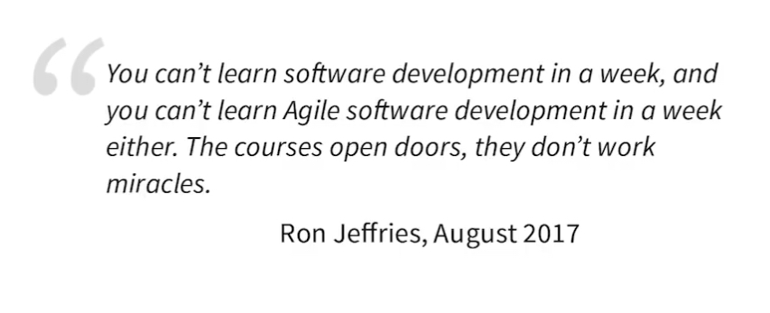

# Formations “coup de boost” et formations “socle”

Status: Structure préparée
Espace: LINKEDIN
Cible: Offre 1 : Coach technique, Offre 2 : Dev Régie
Problématique centrale: Pourquoi travailler avec des entrepreneurs en temps partagé ?
Résolution de la pb: Parce qu’ils investissent et se forment pour mieux répondre à vos besoins.
Objectif: Mentionner Steven et les personnes qui m’ont accompagné cette année . Montrer la différence etq entrepreneur qui investit dans son outil de travail 
TYPE de CONTENU: BUSINESS, FORMATION
CTA: Mentions des gens qui m’ont accompagné 

---

## Contenu

## Carousel

Formations de fond , initiation et renforcement. 

Formations « coup de boost » , “step up” : déblocage, lancer une dynamique, creuser et rendre actionable rapidement

## Draft

---
  
Carousel Formations de fond , initiation et renforcement. Formations « coup de boost » , “step up” : déblocage, lancer une dynamique, creuser et rendre actionable rapidement

Marc Bouvier

Dec 19

 

(edited)

En devenant entrepreneur, je ne m’attendais pas à passer autant de temps à me former. - Steven : marketing / prospection / communication - Geoffrey Huck : prise de parole publique, écoute active, mise en énergie, devenir à l’aise dans des situations inconfortables - Lean poker : @ adapter les techniques de développement à un contexte marché concurentiel. Piloter sa stratégie par oobservabilité. Le Cercle : négociation / marketing / prospection / entreprenariat - Neuro-sciences et prise de notes visuelle : @Benedicte : parmi les formations de ma coopérative @antigone prise de notes visuelles Facilitation avec @Vincent Peiffert : facilitation , analyser et vendre un atelier facilité, construire un déroulé, choisir les outils et les agencer, co-faciliter un atelier - AOF - Hack le chalet - Samman coaching society - pycon - pre post print - demain c’est maintenant

---